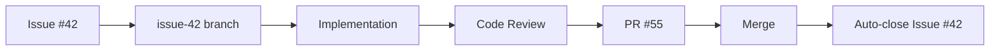

# Git Workflow

## GitHub Flow Integration

### Complete Workflow

```
Issue Creation → Branch Creation → Implementation → Code Review → PR → Merge
     ↓                ↓                  ↓              ↓          ↓       ↓
/create-issue    /start-work         /tdd        /code-review  /finish-work  Merge PR
```

### Branch Naming Convention

**REQUIRED**: All feature branches must follow `issue-{number}` format

✅ **Correct**:
- `issue-42` (for issue #42)
- `issue-123` (for issue #123)

❌ **Incorrect**:
- `feature/notifications`
- `fix-bug`
- `42-feature`
- `my-branch`

### Workflow Commands

1. **Create Issue** (`/create-issue`)
   - Analyze feature requirements
   - Break down into tasks
   - Generate issue with acceptance criteria
   - Return issue number

2. **Start Work** (`/start-work {issue_number}`)
   - Fetch issue details from GitHub
   - Create `issue-{number}` branch from main
   - Run `/plan` to create implementation plan
   - Wait for approval before proceeding

3. **Implement** (use `/tdd`)
   - Test-driven development approach
   - Write tests first (RED)
   - Implement to pass (GREEN)
   - Refactor (IMPROVE)
   - Verify 80%+ coverage

4. **Finish Work** (`/finish-work`)
   - Run `/code-review` automatically
   - Block if CRITICAL/HIGH issues found
   - Create commit with conventional message
   - Push to remote
   - Create PR with issue reference
   - Display PR URL

### Issue → PR Lifecycle



## Commit Message Format

```
<type>: <description>

<optional body>
```

Types: feat, fix, refactor, docs, test, chore, perf, ci

Note: Attribution disabled globally via ~/.claude/settings.json.

**Examples**:
```
feat: add real-time notification system

fix: resolve authentication timeout bug

refactor: improve market search performance

docs: update API documentation for v2
```

## Pull Request Workflow

When creating PRs:
1. Analyze full commit history (not just latest commit)
2. Use `git diff [base-branch]...HEAD` to see all changes
3. Draft comprehensive PR summary
4. Include test plan with TODOs
5. Push with `-u` flag if new branch
6. **Always reference issue**: "Closes #42" in PR body

### PR Title Format

```
<type>: <description> (#<issue_number>)
```

Examples:
- `feat: Add real-time notifications (#42)`
- `fix: Resolve authentication bug (#123)`
- `refactor: Improve market search (#87)`

## Feature Implementation Workflow

### Traditional Workflow
1. **Plan First**
   - Use **planner** agent to create implementation plan
   - Identify dependencies and risks
   - Break down into phases

2. **TDD Approach**
   - Use **tdd-guide** agent
   - Write tests first (RED)
   - Implement to pass tests (GREEN)
   - Refactor (IMPROVE)
   - Verify 80%+ coverage

3. **Code Review**
   - Use **code-reviewer** agent immediately after writing code
   - Address CRITICAL and HIGH issues
   - Fix MEDIUM issues when possible

4. **Commit & Push**
   - Detailed commit messages
   - Follow conventional commits format

### GitHub Flow Workflow (RECOMMENDED)

1. **Create Issue**
   ```bash
   /create-issue {feature description}
   ```
   - Returns issue number (e.g., #42)

2. **Start Work**
   ```bash
   /start-work 42
   ```
   - Creates `issue-42` branch
   - Runs `/plan` automatically
   - Wait for approval

3. **Implement with TDD**
   ```bash
   /tdd {task description}
   ```
   - Write tests first
   - Implement to pass
   - Refactor

4. **Finish Work**
   ```bash
   /finish-work
   ```
   - Runs `/code-review`
   - Commits changes
   - Pushes to remote
   - Creates PR
   - Links to issue

5. **Merge**
   - Wait for reviews
   - Address feedback
   - Merge PR (auto-closes issue)

## Best Practices

### Issue Management
- One issue = One feature/bug/task
- Keep issues small and focused (<400 lines of code)
- Use labels: `feature`, `bug`, `enhancement`, `documentation`
- Assign yourself when starting work
- Update status in issue comments

### Branch Management
- Always branch from `main`
- Pull latest `main` before creating branch: `git fetch origin main`
- Delete branch after PR merge
- Never force push to shared branches
- Keep branch up-to-date with main: `git rebase main`

### Commit Strategy
- Commit often, push regularly
- Each commit should be logical unit
- Write descriptive commit messages
- Use conventional commits format
- Include Co-Authored-By for pair programming

### PR Guidelines
- Keep PRs focused and reviewable
- Include screenshots for UI changes
- Add test plan with checkboxes
- Request specific reviewers
- Respond to feedback promptly
- Squash commits if needed before merge

## Safety Rules

### Never Do This
- ❌ Force push to `main` or shared branches
- ❌ Commit secrets, API keys, or credentials
- ❌ Skip tests or code review
- ❌ Create PRs without issue reference
- ❌ Work directly on `main` branch
- ❌ Merge without approval
- ❌ Use `--no-verify` flag (unless explicitly needed)

### Always Do This
- ✅ Branch from latest `main`
- ✅ Write tests before implementation
- ✅ Run `/code-review` before PR
- ✅ Link PRs to issues
- ✅ Keep PRs small (<400 lines)
- ✅ Respond to review feedback
- ✅ Update documentation

## Quick Reference

```bash
# Full GitHub Flow
/create-issue {description}  # Create issue
/start-work 42               # Start on issue #42
/tdd {task}                  # Implement with TDD
/finish-work                 # Review, commit, PR

# Manual operations
gh issue list                # List all issues
gh issue view 42             # View issue details
gh pr list                   # List PRs
gh pr view 55                # View PR details
gh pr checks 55              # Check CI/CD status
gh pr merge 55               # Merge PR

# Branch operations
git fetch origin main        # Fetch latest main
git checkout -b issue-42     # Create branch
git branch -d issue-42       # Delete branch (after merge)
git rebase main              # Update with main

# Review operations
git diff main                # See changes vs main
git log origin/main..HEAD    # See new commits
```

## Related Tools

- **GitHub CLI (`gh`)**: Required for issue/PR management
  ```bash
  brew install gh
  gh auth login
  ```

- **Git hooks**: Configured in `~/.claude/settings.json`
  - Pre-commit: Run tests, linter
  - Pre-push: Code review reminder
  - Commit-msg: Validate format

## Related Commands

- `/create-issue` - Create GitHub issue
- `/start-work` - Start working on issue
- `/finish-work` - Complete work and create PR
- `/plan` - Create implementation plan
- `/tdd` - Test-driven development
- `/code-review` - Review code before PR

## Related Agents

- `github-flow-manager` - GitHub Flow orchestration
- `planner` - Implementation planning
- `tdd-guide` - Test-driven development
- `code-reviewer` - Code quality review
